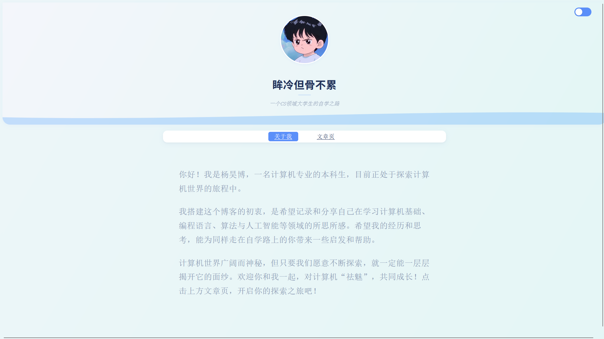
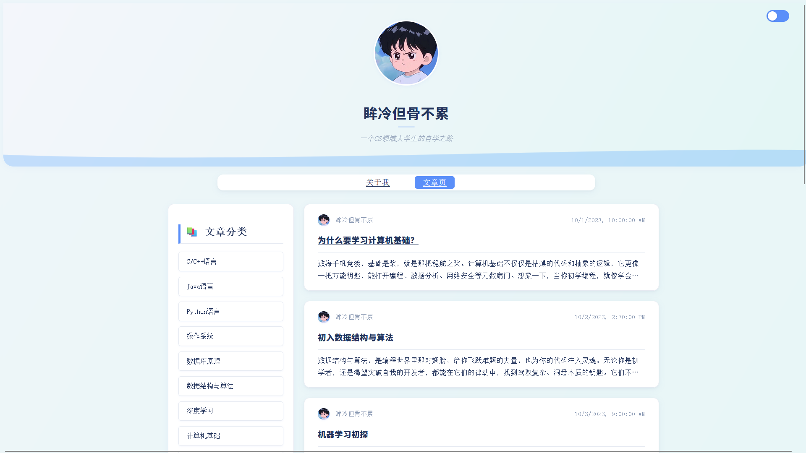
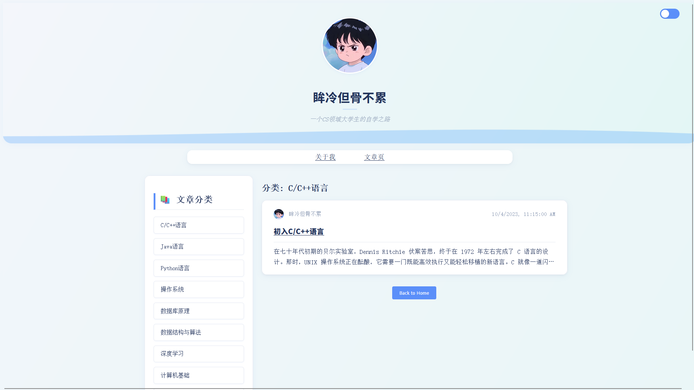
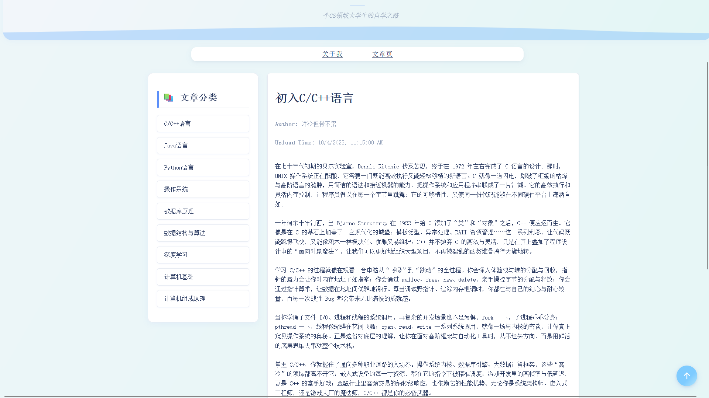

# 个人博客项目

这是一个基于 Vue 和 Node.js 构建的个人博客系统，支持文章发布、主题切换、动态展示和基本的分类管理。整个项目部署在阿里云服务器上，已上线运行，可通过访问 `http://120.77.238.56` 体验网站功能。

## ✨ 项目亮点功能

- **文章系统**：支持文章的增删改查，内容包括作者信息、头像、标题、正文及上传时间。
- **主题切换**：支持白天模式与暗黑模式，可根据用户偏好切换界面风格。
- **动态自我介绍**：首页采用打字机特效展示站长自我介绍与网站主题，提升用户交互体验。
- **回到顶部功能**：文章页面支持一键返回顶部，优化长文阅读体验。
- **分类侧边栏**：支持随滚动条动态定位，帮助用户快速定位当前阅读位置。
- **动态 Header 海浪效果**：为网站顶部添加流畅自然的海浪动画，提升视觉美感。
- **动态标签页标题**：实现了标签页标题的动态变化，切换到其他网页时标题会变为“诶，你怎么走啦？”，返回时变为“诶，你又回来啦！”，两秒后自动恢复为“眸冷但骨不累”。

## 🛠 技术栈

### 前端

- [Vue.js](https://vuejs.org/)：渐进式 JavaScript 框架，用于构建交互式 UI。
- [Vue Router](https://router.vuejs.org/)：用于处理前端路由。
- CSS / SCSS：页面样式与动画效果。
- Axios：前后端通信。

### 后端

- [Node.js](https://nodejs.org/)：基于事件驱动的 JavaScript 运行环境。
- [Express](https://expressjs.com/)：轻量级 Web 服务框架。
- [MySQL](https://www.mysql.com/)：关系型数据库，用于数据持久化。
- [PM2](https://pm2.keymetrics.io/)：进程管理工具，保证服务稳定运行。
- [Nginx](https://www.nginx.com/)：反向代理与负载均衡，作为前后端接口转发器与静态资源托管工具。

## 🌐 部署信息

- **服务器**：阿里云 ECS 实例
- **访问地址**：[http://120.77.238.56](http://120.77.238.56)
- **部署结构**：
  - 前端打包后部署至 Nginx
  - 后端 Node.js 服务通过 PM2 守护运行
  - 使用 Nginx 配置反向代理，实现前后端分离架构

## 📸 页面预览






## 🧭 项目结构（简略）

```bash
├── frontend/             # 前端 Vue 项目根目录
│   ├── src/
│   │   ├── assets/            # 静态资源
│   │   ├── components/        # Vue 组件
│   │   │   └── main-page/     # 主要页面相关组件
│   │   ├── router/            # 路由配置
│   │   ├── App.vue
│   │   └── main.js
│   ├── public/                # 公共资源
│   ├── index.html
│   ├── package.json
│   ├── vite.config.js         # 构建工具配置
│   └── README.md
```

```bash
├── node_modules/            # 前端 Vue 项目
├── server/                  # 后端 Node.js + Express 服务
│   ├── app.js               # 主入口文件
│   ├── db.js                # 数据库连接与操作
│   ├── routes/              # 路由模块（可选）
│   ├── controllers/         # 控制器（可选）
│   └── config/              # 配置文件（可选）
├── nginx/                   # Nginx 配置文件
├── ecosystem.config.js      # PM2 配置
└── README.md
```